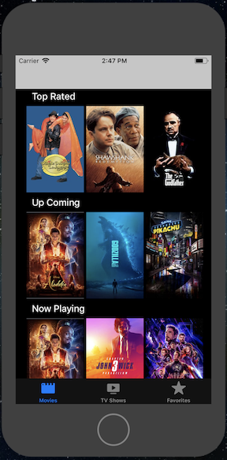

# MoVision
This is my final project in iOS nano-degree program.

# Table of Contents
* [Requirements](#req) 
* [Installation](#install) 
* [Description](#description) 
* [Details](#details) 
* [User Interface](#ui) 
* [Demo](#demo) 
* [Feature Wishlist](#features)

<a name="req">

## Requirements

* TMBD API Key is required for this project. Put the API key in `/Models/Shared/TMBDAPIKey.swift`
* Xcode 10.2
* Swift 5.0
* [Kingfisher](https://github.com/onevcat/Kingfisher)
* [Alamofire](https://github.com/Alamofire/Alamofire)

<a name="install">

## Installation

* `git clone https://github.com/sdanyalk/MoVision.git`
* `cd MoVision`
* `pod install`

<a name="description">

## Description

This is a one stop app for all your entertainment needs. It shows a list of movie and tv shows. These are divided into three categories. Categories are top rated, up coming and currently playing/showing.

You can click on any movie or tv show to see more details about it.

In addition to that you can also mark any movie and/or tv show as a favorite. This will create a separate list of all your favorite movies and/or tv shows.

If you want to remove any movie or tv show from your favorites, all you have to do is swipe left and it will be deleted. Other way you can do is by going into the detail screen and unselecting the **heart** button.

<a name="details">

## Details

### User Interface

* There are 4 controllers:
  - Movies view controller
  - TV Shows view controller
  - Favorites view controller
  - Detail view controller
* The first 3 view controllers are part of tab bar controller.
* Detail view controller is presented from Movies and TV Shows view controllers.
* Movies and TV Shows controllers contains a horizonatal collection view to show the poster images.
* Favorites view controller contains a table view to show poster image and title.

### Networking

* The Movie Database API is used to retrieve both the movies and tv shows. Information like:
  - Title
  - Poster
  - Release Date
  - Number of Votes
  - Average number of votes
* While an online search is in progress, an Activity Indicator is displayed.
* An alert view will be displayed, if there was a network error.
* The poster image, once retrieved, will be cached to reduce network requests.

### Persistence

* Favorite Movies and TV shows are stored in Core Data.
* Constraints favorite movie and tv show duplicates.
* Movie and TV shows are sorted by latest date.

<a name="ui">

## User Interface

### Movie List and Detail

Movies are divided into three categories: **Top Rated**, **Up Coming** and **Now Playing**

### TV Show List

TV shows are divided into three categories: **Top Rated**, **Up Coming** and **Now Playing**

### Favorite List

Favorites are divided into two categories: **Liked Movies** and **Liked TV Shows**

<a name="demo">

## Demo

